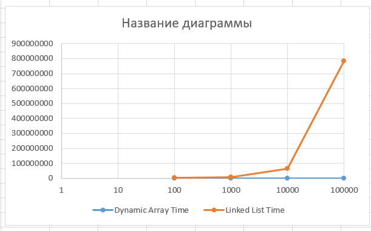
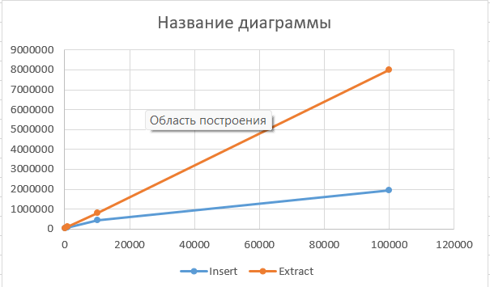

Assignment 2 — Algorithmic Analysis, Correctness and Performance Trade-offs

Overview

This assignment implements and analyzes three basic data structures:

Dynamic Array

Linked List

Min-Heap

The main goal is to compare their operations, analyze their time complexity, prove the correctness of selected algorithms using loop invariants, and measure their performance experimentally.

The project was implemented in Java.

Project Structure

```text
assignment-2/
├── src/
│   ├── DynamicArray.java
│   ├── LinkedList.java
│   ├── MinHeap.java
│   ├── Benchmark.java
│   └── Tests.java
│
├── results/
│   ├── benchmark_results.csv
│   ├── tables/
│   │   ├── workload1.png
│   │   ├── workload2.png
│   │   ├── workload3.png
│   │   └── workload4.png
│   │
│   └── plots/
│       ├── workload1_time.png
│       ├── workload1_accesses.png
│       ├── workload2_time.png
│       └── workload4_time.png
│
└── README.md
```

Implemented Operations

Dynamic Array

The Dynamic Array supports:

add(x) - adds an element to the end

add(index, x) - inserts an element at a specified index

remove(index) - removes an element

get(index) - returns an element at an index

contains(x) - searches for an element

The array automatically increases its capacity when it becomes full.

Linked List

The Linked List supports:

add(x)

add(index, x)

remove(index)

get(index)

contains(x)

The list is implemented using nodes connected with references.

Min-Heap

The Min-Heap supports:

insert(x)

peekMin()

extractMin()

The smallest element is always stored at the root of the heap.

After every insertion and extraction, the heap property is maintained.


Complexity Analysis

The following table shows the theoretical complexity of the implemented operations.

| Data Structure | Operation       | Best Case | Average Case | Worst Case | Auxiliary Space |
| -------------- | --------------- | --------- | ------------ | ---------- | --------------- |
| Dynamic Array  | `add(x)`        | Ω(1)      | Θ(1)         | O(n)       | O(1)            |
| Dynamic Array  | `add(index, x)` | Ω(1)      | Θ(n)         | O(n)       | O(1)            |
| Dynamic Array  | `remove(index)` | Ω(1)      | Θ(n)         | O(n)       | O(1)            |
| Dynamic Array  | `get(index)`    | Ω(1)      | Θ(1)         | O(1)       | O(1)            |
| Dynamic Array  | `contains(x)`   | Ω(1)      | Θ(n)         | O(n)       | O(1)            |
| Linked List    | `add(x)`        | Ω(1)      | Θ(n)         | O(n)       | O(1)            |
| Linked List    | `add(0, x)`     | Θ(1)      | Θ(1)         | O(1)       | O(1)            |
| Linked List    | `add(index, x)` | Ω(1)      | Θ(n)         | O(n)       | O(1)            |
| Linked List    | `remove(0)`     | Θ(1)      | Θ(1)         | O(1)       | O(1)            |
| Linked List    | `remove(index)` | Ω(1)      | Θ(n)         | O(n)       | O(1)            |
| Linked List    | `get(index)`    | Ω(1)      | Θ(n)         | O(n)       | O(1)            |
| Linked List    | `contains(x)`   | Ω(1)      | Θ(n)         | O(n)       | O(1)            |
| Min-Heap       | `insert(x)`     | Ω(1)      | O(log n)     | O(log n)   | O(1)            |
| Min-Heap       | `peekMin()`     | Θ(1)      | Θ(1)         | Θ(1)       | O(1)            |
| Min-Heap       | `extractMin()`  | Ω(1)      | O(log n)     | O(log n)   | O(1)            |

For the Min-Heap, one insert or extractMin operation takes up to O(log n) time. When n elements are inserted or extracted, the total worst-case work is O(n log n).

Main Complexity Differences

A Dynamic Array provides constant-time random access because an element can be accessed directly using its index.

A Linked List needs to move through the nodes to reach an index, so random access takes linear time.

For insertion and removal at the beginning, a Linked List is efficient because only references need to be changed. A Dynamic Array needs to shift many elements.

Searching with contains(x) is linear for both structures because the elements are not sorted.

A Min-Heap is useful for priority processing because it can quickly access the smallest element.


Correctness

Two operations were selected for loop invariant analysis:

1. Dynamic Array insertion
2. Min-Heap insertion


1. Dynamic Array Insertion Loop Invariant

When inserting an element at a specified index, the elements after the index must be shifted one position to the right.

Initialization

Before the loop starts, the last element is moved to a free position. The elements before the insertion index are unchanged.

Therefore, the array structure is ready for shifting.

Maintenance

During every iteration, the current element is moved one position to the right.

After each iteration, all processed elements are in their correct shifted positions.

Termination

The loop stops when the insertion index is reached.

At this point, all elements after the index have been shifted one position to the right.

Correctness

The new element can now be placed at the requested index. Therefore, the final array contains all original elements in the correct order plus the new element.


2. Min-Heap Insertion Loop Invariant

When a new element is inserted into the heap, it is initially placed at the end of the array. It may then move upward while it is smaller than its parent.

Initialization

Before the loop starts, the new element is placed at the last position.

The heap property is still correct for all other nodes.

Maintenance

During each iteration, the new element is compared with its parent.

If the new element is smaller, the two elements are swapped.

After the swap, the heap property is restored for the current position.

Termination

The loop stops when the element reaches the root or becomes greater than or equal to its parent.

Correctness

At termination, the new element is in a valid position and every parent is smaller than or equal to its children.

Therefore, the Min-Heap property is maintained.


Experimental Setup

The experiments were performed using Java and System.nanoTime().

The following input sizes were used:

```text
n = 100
n = 1,000
n = 10,000
n = 100,000
```

Each experiment was repeated 5 times.

The average execution time was calculated from the five runs.

A fixed random seed was used:


Random(42)


This makes the experiments reproducible.

Input data was generated before the timed section. Input generation and printing were not included in the measured execution time.

The benchmark results were saved in:


results/benchmark_results.csv


Workloads

Workload 1 — Random Access

Dynamic Array and Linked List were tested using the `get(index)` operation.

For each input size, 10,000 random indices were generated.

The following metrics were recorded:

execution time

number of element accesses

The Dynamic Array showed constant-time random access, while the Linked List required traversal through nodes.




Workload 2 — Search

The contains(x) operation was tested for both Dynamic Array and Linked List.

For each input size, 1,000 search values were generated.

The following metrics were recorded:

execution time

number of comparisons

Both data structures have linear search complexity because the elements are checked one by one.


Workload 3 — Insertion and Removal

Insertion and removal were tested at two positions:

beginning

middle

For each case, 1,000 operations were performed.

The number of element movements was also recorded.

The Linked List was much more efficient for operations at the beginning because it only changes node references.

For middle operations, the Linked List needs to traverse the list to reach the required position.

The Dynamic Array needs to shift elements during insertion and removal.


Workload 4 — Priority Processing

The Min-Heap was tested with:

* `n` insertions
* `n` extractions

The execution time and number of comparisons were recorded.

After extracting all elements, the program checked that the output was in non-decreasing order.

The following input sizes were tested:

```text
100
1,000
10,000
100,000
```



The results show that the number of comparisons and execution time increase as the input size increases.


Results

The main experimental results are stored in:

```text
results/benchmark_results.csv
```

Tables with the benchmark results are stored in:

```text
results/tables/
```

The plots are stored in:

```text
results/plots/
```

## Workload 1 Results

|      n | Dynamic Array Time (ns) | Linked List Time (ns) | Array Accesses | List Accesses |
| -----: | ----------------------: | --------------------: | -------------: | ------------: |
|    100 |                  324900 |               1076900 |          10000 |        511508 |
|   1000 |                   70380 |               6229200 |          10000 |       5015208 |
|  10000 |                   20660 |              65621320 |          10000 |      50139208 |
| 100000 |                    6420 |             785197540 |          10000 |     502499208 |

The number of Dynamic Array accesses stays constant because direct indexing is used. Linked List accesses increase with the input size.

## Workload 2 Results

|      n | Dynamic Array Time (ns) | Linked List Time (ns) | Array Comparisons | List Comparisons |
| -----: | ----------------------: | --------------------: | ----------------: | ---------------: |
|    100 |                  373280 |                334520 |             95046 |            95046 |
|   1000 |                  646920 |               1004780 |            500092 |           500092 |
|  10000 |                  170000 |                840080 |            500092 |           500092 |
| 100000 |                  168600 |                745760 |            500092 |           500092 |

Both structures perform the same number of comparisons because both use linear search.

## Workload 4 Results

|      n | Operation  | Average Time (ns) | Comparisons |
| -----: | ---------- | ----------------: | ----------: |
|    100 | insert     |             16460 |         194 |
|    100 | extractMin |             37180 |         841 |
|   1000 | insert     |             80140 |        2232 |
|   1000 | extractMin |            122440 |       14994 |
|  10000 | insert     |            434780 |       22593 |
|  10000 | extractMin |            789680 |      216736 |
| 100000 | insert     |           1948780 |      227662 |
| 100000 | extractMin |           8013440 |     2831463 |

---

# Discussion

## 1. How does input size affect performance?

As `n` increases, operations that require traversing or moving many elements generally take more time.

The difference is especially clear in Workload 1. The Linked List needs many node accesses to perform random access, while the Dynamic Array can directly access an element by its index.

## 2. Do the experimental results agree with the theoretical complexity?

In general, the results agree with the theoretical analysis.

The Dynamic Array has constant-time `get`, while Linked List `get` becomes much more expensive as `n` increases.

Both Dynamic Array and Linked List have linear search complexity.

For insertion and removal at the beginning, the Linked List requires much less work than the Dynamic Array.

The Min-Heap results also show increasing execution time and comparisons as the input size grows.

Small differences between theory and measured time are expected because actual execution also depends on the Java Virtual Machine, computer hardware, memory access, and other system processes.

## 3. Why can two operations with the same Big-O have different execution times?

Big-O describes the growth rate of an algorithm, but it does not show every constant factor.

Two `O(n)` operations can perform different amounts of work.

For example, Dynamic Array and Linked List both have `O(n)` search complexity, but their memory access patterns are different. A Dynamic Array stores elements continuously, while a Linked List uses separate nodes connected by references.

Therefore, their measured execution times can be different.

## 4. When is a Dynamic Array preferable?

A Dynamic Array is preferable when the program needs:

* frequent random access
* access by index
* good memory locality
* relatively few insertions and removals in the middle or beginning

For example, it is useful when the main operation is reading elements by their index.

## 5. When is a Linked List useful?

A Linked List can be useful when many insertions and removals are performed at the beginning or when a reference to the required node is already available.

It is less suitable when the program frequently needs random access by index.

## 6. Why is a Heap useful for priority processing?

A Min-Heap keeps the smallest element at the root.

Therefore, the minimum value can be obtained efficiently with `peekMin()`, and `extractMin()` can remove the minimum while restoring the heap property.

This makes a heap suitable for priority queues and priority processing.

## 7. How does the workload influence the choice of data structure?

Different workloads require different data structures.

For example:

* frequent random access → Dynamic Array
* frequent insertion/removal at the beginning → Linked List
* priority processing → Min-Heap
* simple linear search → both Dynamic Array and Linked List can be used

Therefore, the best data structure depends on which operations are performed most frequently.

---

# Design Recommendations

The experimental results show that data structure choice should depend on the main workload.

A Dynamic Array is a good choice when fast index-based access is important.

A Linked List is useful when insertion and removal at the beginning are frequent.

A Min-Heap is appropriate when the application needs to repeatedly process the smallest element.

Theoretical complexity should be considered together with practical measurements because constant factors and implementation details can affect real execution time.

---

# Testing

The `Tests.java` file checks different cases for the implemented data structures.

The tests include:

* empty structures
* one element
* multiple elements
* duplicate values
* boundary indices
* invalid indices
* large inputs
* heap property after insertion
* heap property after extraction
* non-decreasing order of extracted heap elements

The benchmark also checks that Min-Heap extraction produces elements in non-decreasing order.

If the order is incorrect, the benchmark throws an exception.

---

# Conclusion

This assignment demonstrates how different data structures behave under different workloads.

The Dynamic Array provides fast random access.

The Linked List provides efficient insertion and removal at the beginning.

Both structures have linear search complexity.

The Min-Heap provides efficient priority processing with logarithmic individual insertion and extraction operations.

The experimental results generally support the theoretical complexity analysis. The measurements also show that the actual performance of an algorithm depends not only on Big-O complexity, but also on implementation details, constant factors, memory access, and the type of workload.
